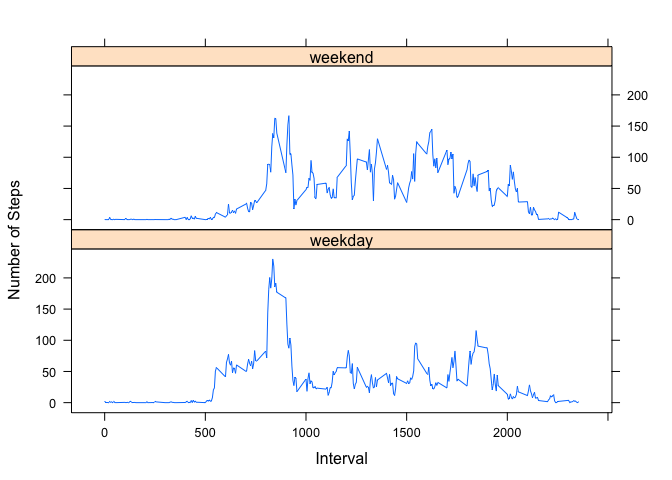

# Reproducible Research: Peer Assessment 1

## Load some libraries that will be used

```r
library(ggplot2)
library(lattice)
```

## Set some preferences

```r
options(scipen = 1) # Do not allow scientific notation
```

## Set the working directory

```r
setwd("~/Documents/Coursera/Reproducible Research/Peer Assessment 1/RepData_PeerAssessment1/")
```

## Loading and preprocessing the data

```r
data <- read.csv("activity.csv", colClasses = c("integer", "Date", "factor"))
```

## What is mean total number of steps taken per day?

```r
hist(tapply(data$steps, data$date, sum), xlab = "Total Steps per Day", breaks = 20, main = "Total Steps per Day")
```

 

```r
stepsMeanDaily <- mean(as.numeric(tapply(data$steps, data$date, sum)), na.rm = TRUE)
stepsMeanDaily
```

```
## [1] 10766.19
```

```r
stepsMedianDaily <- median(as.numeric(tapply(data$steps, data$date, sum)), na.rm = TRUE)
stepsMedianDaily
```

```
## [1] 10765
```

## What is the average daily activity pattern?

```r
data$interval <- as.factor(as.character(data$interval))
dataIntervalMean <- as.numeric(tapply(data$steps, data$interval, mean, na.rm = TRUE))
intervals <- data.frame(intervals = as.numeric(levels(data$interval)), dataIntervalMean)
intervals <- intervals[order(intervals$intervals),]

labels <- c("00:00", "05:00", "10:00", "15:00", "20:00")
labels.at <- seq(0, 2000, 500)
plot(intervals$intervals, intervals$dataIntervalMean, type="l", main = "Average Steps - 5 minute Intervals", ylab = "Average Steps", xlab="Time of Day", xaxt = "n")
axis(side = 1, at = labels.at, labels = labels)
```

 


```r
highestMean <- round(max(intervals$dataIntervalMean),1)
startTimeOfMax <- intervals[which.max(intervals$dataIntervalMean),1]
endTimeOfMax <- startTimeOfMax + 5
```
The time interval with the highest mean/average steps was: 835am - 840am. The mean/average steps for this time period was: 206.2.

## Imputing missing values
We will fill in the missing values (NA) with the mean values for that 5 minute interval


```r
steps <- vector()
for(i in 1:dim(data)[1]) {
        if (is.na(data$steps[i])) {
                steps <- c(steps, intervals$dataIntervalMean[intervals$intervals == data$interval[i]])
        }
        else {
                steps <- c(steps, data$steps[i])
        }
}

dataNoNA <- data.frame(steps = steps, date = data$date, interval = data$interval)
```

```r
hist(tapply(dataNoNA$steps, dataNoNA$date, sum), xlab="Total Daily Steps", breaks=20, main = "Total Steps per Day")
```

 


```r
dataNoNA.totalSteps <- as.numeric(tapply(dataNoNA$steps, dataNoNA$date, sum))
dataNoNA.mean <- round(mean(dataNoNA.totalSteps),2)
dataNoNA.median <- round(median(dataNoNA.totalSteps),2)
```


```r
dataNoNA.mean
```

```
## [1] 10766.19
```


```r
dataNoNA.median
```

```
## [1] 10766.19
```
The new mean and median of the total number of steps per day after filling in the NA values is 10766.19 and 10766.19, respectively. The values are the same, and different from the original data set with the NAs in it, as we filled in the NAs in this data set with mean values. If we had chosen a different method, the mean and median would have been different results as well. 

## Are there differences in activity patterns between weekdays and weekends?

```r
dataNoNA$weekdays <- factor(format(dataNoNA$date, "%A"))
levels(dataNoNA$weekdays)
```

```
## [1] "Friday"    "Monday"    "Saturday"  "Sunday"    "Thursday"  "Tuesday"  
## [7] "Wednesday"
```

```r
levels(dataNoNA$weekdays) <- list(weekday = c("Monday", "Tuesday", "Wednesday", "Thursday", "Friday"), weekend = c("Saturday", "Sunday"))
levels(dataNoNA$weekdays)
```

```
## [1] "weekday" "weekend"
```

```r
table(dataNoNA$weekdays)
```

```
## 
## weekday weekend 
##   12960    4608
```


```r
avgSteps <- aggregate(dataNoNA$steps, list(interval = as.numeric(as.character(dataNoNA$interval)), weekdays = dataNoNA$weekdays), FUN="mean")
names(avgSteps)[3] <- "meanOfSteps"
xyplot(avgSteps$meanOfSteps ~ avgSteps$interval | avgSteps$weekdays, layout = c(1,2), type = "l", xlab = "Interval", ylab = "Number of Steps")
```

 
